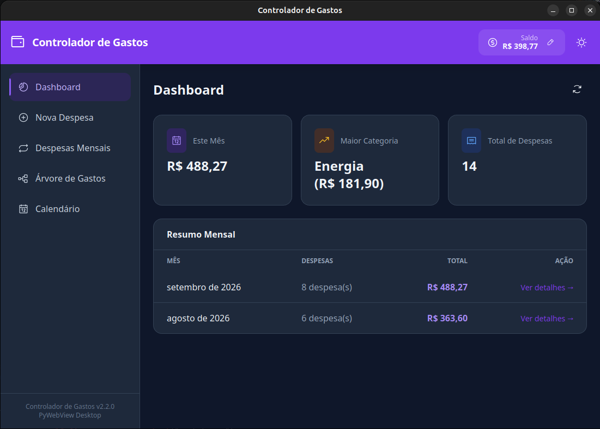
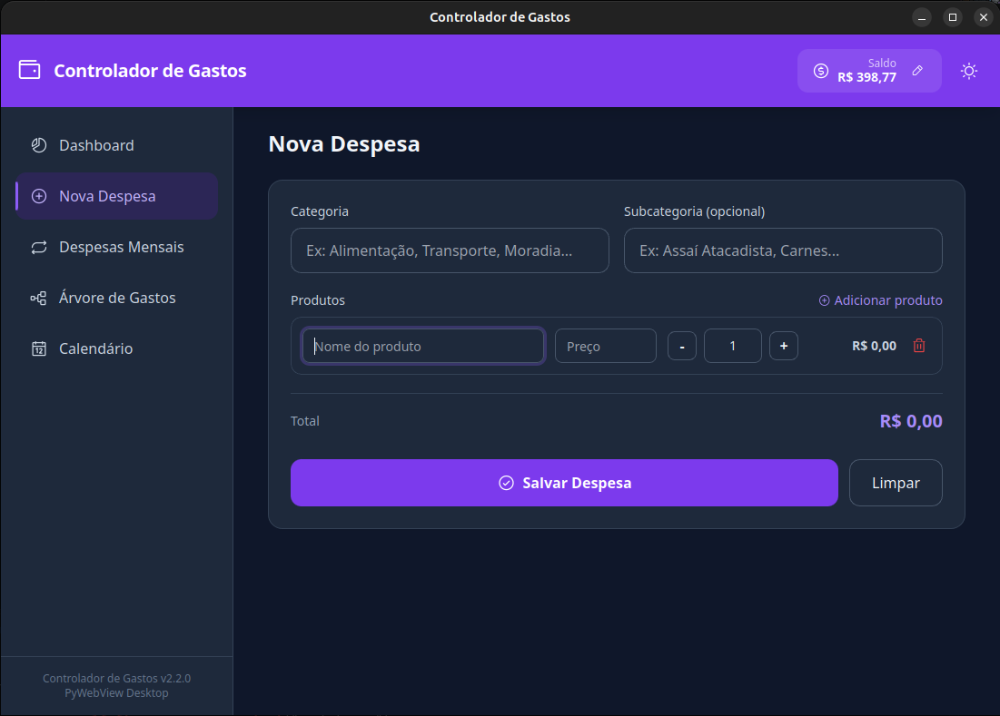
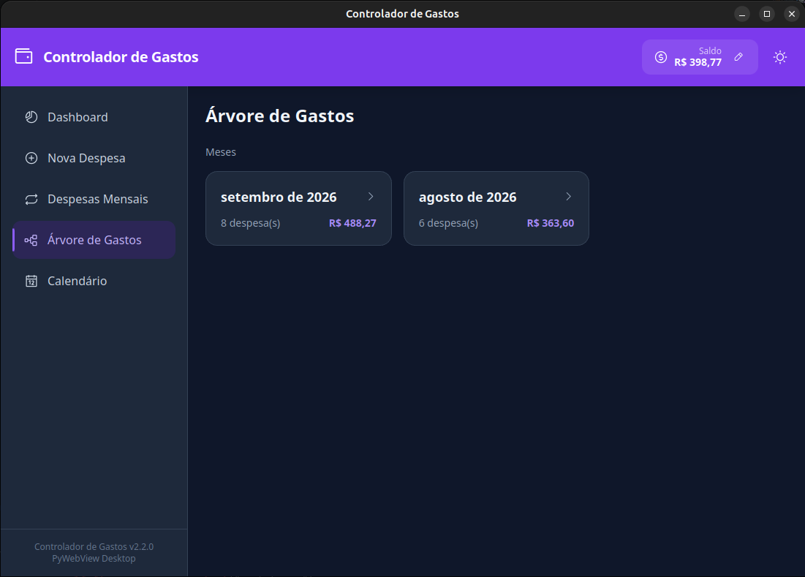
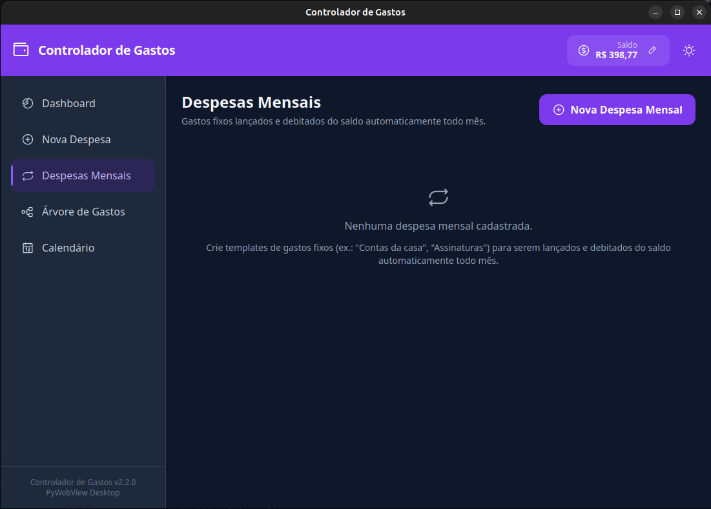
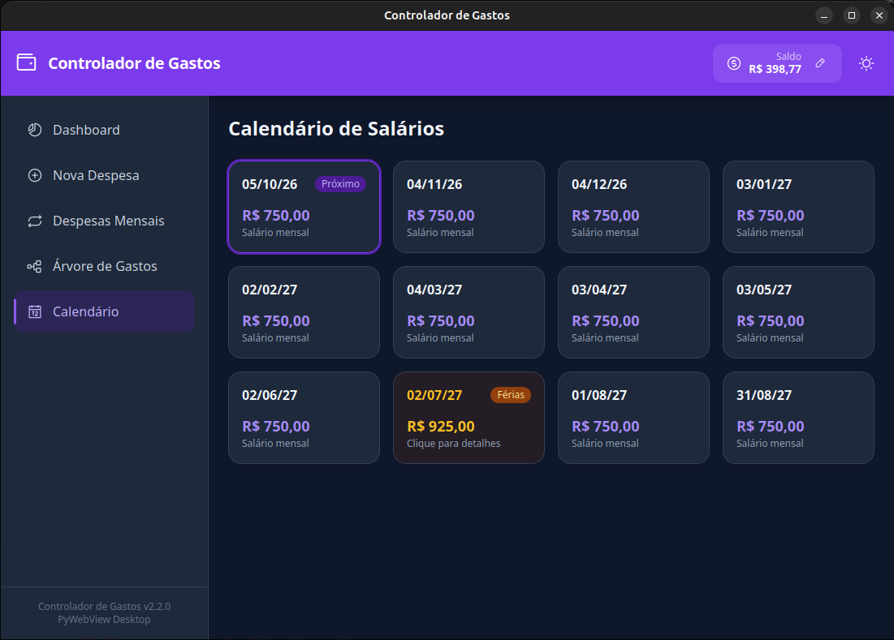

# Controlador de Gastos

Aplicativo desktop nativo para controle financeiro pessoal, construído com
**Python + PyWebView** e interface moderna em **HTML/CSS/JS**.


---

## Sobre

O **Controlador de Gastos** é um app de gerenciamento financeiro pessoal que
roda nativamente no **Ubuntu Linux** (e derivados). Ele foi projetado para
ser simples, rápido e funcional — sem depender de serviços em nuvem ou
conexão com a internet.

Toda a lógica de negócio e persistência de dados roda localmente via
**SQLite**, enquanto a interface é uma **Single Page Application (SPA)**
moderna com tema claro/escuro, animações suaves e navegação intuitiva.

> **Precisão monetária:** todos os valores em dinheiro (despesas, saldo,
> salário) são tratados com `decimal.Decimal` em Python e persistidos em
> colunas `DECIMAL` no SQLite, evitando os erros de arredondamento típicos
> de `float` (ex.: `0.1 + 0.2 != 0.3`). Bancos criados por versões
> anteriores (colunas `REAL`) são migrados automaticamente na primeira
> abertura, sem perda de dados.

---

## Funcionalidades

| Recurso | Descrição |
|---------|-----------|
| **Cadastro de Despesas** | Categoria e subcategoria compartilhadas, com lista de produtos (nome, preço unitário e quantidade) |
| **Preço unitário × Quantidade** | Total calculado automaticamente, com suporte a quantidades fracionárias (ex.: `0,750 kg` de picanha a R$ 60,00/kg) |
| **Árvore de Gastos** | Navegação hierárquica: **Mês → Categoria → Subcategoria (se usada) → Despesas** |
| **Despesas Mensais** | Templates de gastos recorrentes (ex.: "Contas da casa", "Assinaturas"), lançados e debitados do saldo automaticamente todo mês |
| **Dashboard** | Resumo mensal com totais, contagem de despesas e maior categoria do mês |
| **Saldo da Conta** | Informe seu saldo atual — o app subtrai (ou devolve) automaticamente a cada despesa registrada, editada ou excluída |
| **Salário Mensal** | Configure seu salário e a próxima data de recebimento — o crédito acontece a cada 30 dias reais |
| **Calendário de Salários** | Projeção dos próximos recebimentos, com destaque para o mês de férias e cálculo líquido (INSS + IRRF) |
| **Tema Claro/Escuro** | Alterne entre temas com persistência em disco |
| **Edição/Exclusão** | Edite ou exclua despesas diretamente na Árvore de Gastos, com ajuste automático do saldo |

---

<details>
<summary>Ver screenshots</summary>

### Dashboard


### Nova Despesa


### Árvore de Gastos


### Despesas Mensais


### Calendário de Salários


</details>

---

## Requisitos

- **Ubuntu Linux** (ou derivados: Mint, Pop!_OS, Zorin, elementary, etc.)
- **Python 3.10+**
- Dependências do sistema GTK 3 + WebKit2GTK

---

## Instalação Rápida

### 1. Clone o repositório

```bash
git clone https://github.com/Sonver20/Controlador-Gastos.git
cd Controlador-Gastos
```

### 2. Instale as dependências do sistema

```bash
sudo apt-get update
sudo apt-get install -y python3-pip python3-venv python3-gi \
    gir1.2-gtk-3.0 gir1.2-webkit2-4.0
```

### 3. Crie um virtualenv e instale o PyWebView

```bash
python3 -m venv .venv --system-site-packages
.venv/bin/pip install pywebview
```

> O `--system-site-packages` é necessário para que o virtualenv enxergue o
> `gi` (PyGObject) instalado pelo sistema, que o PyWebView usa para falar
> com o GTK.

### 4. Execute o app

```bash
.venv/bin/python app.py
```

---

## Instalação Automática (recomendado)

Execute o script de instalação, que configura tudo automaticamente:

```bash
chmod +x install.sh
./install.sh
```

Isso irá:

- Verificar e instalar as dependências do sistema
- Criar um virtualenv com acesso ao GTK do sistema
- Instalar o PyWebView
- Criar o launcher `run.sh`
- Registrar o app no menu do Ubuntu

Após a instalação, abra o app pelo menu do sistema: pressione `Super` e
digite **"Controlador de Gastos"**.

---

## Versionamento

Este projeto segue [Semantic Versioning](https://semver.org/lang/pt-BR/)
(`MAJOR.MINOR.PATCH`) a partir da versão 2.0.0. A versão atual está em
`version.py` (única fonte de verdade — o rodapé do app busca esse valor
automaticamente) e o histórico de mudanças fica em
[CHANGELOG.md](CHANGELOG.md).

---

## Arquitetura

```
┌─────────────────────────────────────────┐
│           PyWebView Window              │
│  ┌─────────────────────────────────┐    │
│  │      HTML/CSS/JS Frontend       │    │
│  │  (SPA com Tailwind + Phosphor)  │    │
│  └─────────────┬───────────────────┘    │
│                │ pywebview.api          │
│  ┌─────────────▼───────────────────┐    │
│  │      Python API Bridge          │    │
│  │         (class Api)             │    │
│  └───┬─────────────┬───────────────┘    │
│      │ leituras     │ regra de negócio  │
│      │ puras        │                   │
│      │      ┌───────▼───────────┐       │
│      │      │  services/        │       │
│      │      │  finance.py       │       │
│      │      │  scheduler.py     │       │
│      │      │  payroll.py       │       │
│      │      │  monthly.py       │       │
│      │      └───────┬───────────┘       │
│  ┌───▼──────────────▼──────┐  ┌──────┐  │
│  │  database.py (SQLite)   │  │config│  │
│  │  conexões, schema, SQL  │  │(JSON)│  │
│  └─────────────────────────┘  └──────┘  │
└─────────────────────────────────────────┘
```

O `database.py` é **exclusivamente persistência**: abre conexões, cria e
migra o schema, executa SQL. Nenhuma decisão de negócio (cálculo de
imposto, ciclo de salário, ajuste de saldo) mora ali — isso tudo fica nos
módulos em `services/`, o que mantém o código testável e o banco
substituível.

---

## Testes

Execute os testes automatizados:

```bash
python3 tests.py -v
```

Cobertura:

- **CRUD completo** de despesas (create, read, update, delete)
- **Agregações mensais** e drill-down hierárquico (mês → categoria → subcategoria)
- **Subcategorias e quantidade × preço unitário** (incluindo quantidades fracionárias)
- **Precisão decimal** ponta a ponta (sem drift de float, mesmo após reabrir o banco)
- **Saldo e salário** (crédito, débito, preservação de campos em updates)
- **Calendário de salários** com projeção de 30 em 30 dias e cálculo de férias (INSS/IRRF)
- **Despesas Mensais** (criação, aplicação, não-duplicação no mesmo mês)
- **Migração automática** de bancos antigos (colunas `REAL` → `DECIMAL`, novas colunas aditivas)
- **Rollback** em caso de exceção no meio de uma transação
- **API Bridge** — todos os métodos expostos ao JavaScript

---

## Tecnologias

| Camada | Tecnologia |
|--------|------------|
| Backend | Python 3, SQLite3 |
| Desktop Wrapper | PyWebView (GTK/WebKit) |
| Frontend | HTML5, CSS3, Vanilla JavaScript |
| UI Framework | Tailwind CSS (local em `assets/tailwind.js`) |
| Ícones | Phosphor Icons (fonte local em `assets/phosphor-regular.css`) |

Todas as dependências de frontend ficam **versionadas no repositório**
dentro de `assets/` — o app abre e funciona sem nenhuma conexão com a
internet.

---

## Licença

MIT License — livre para uso pessoal e comercial.

---

## Autor

Feito por [Everson](https://github.com/Sonver20).

---

## Agradecimentos

Este projeto só existe graças a estas ferramentas e bibliotecas:

- [PyWebView](https://pywebview.flowrl.com/) — a ponte Python ↔ JavaScript que torna tudo possível
- [SQLite](https://sqlite.org/) — banco de dados embutido, sem servidor
- [Python](https://python.org/) — linguagem do backend
- [Tailwind CSS](https://tailwindcss.com/) — estilização da interface
- [Phosphor Icons](https://phosphoricons.com/) — ícones limpos e modernos
- [GTK](https://gtk.org/) e [WebKitGTK](https://webkitgtk.org/) — toolkit gráfico que roda a UI no Linux